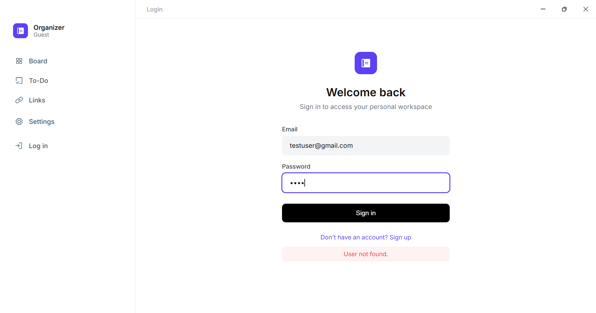
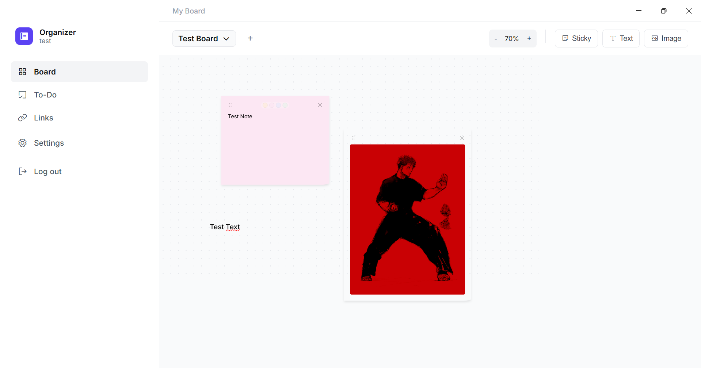
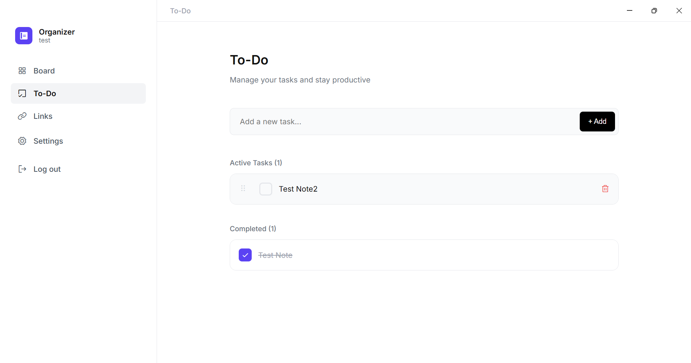
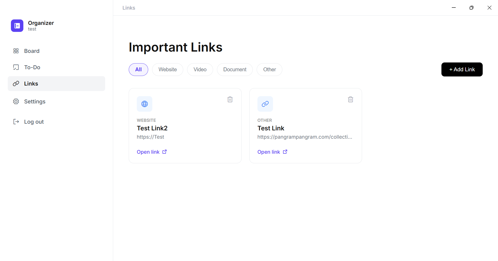
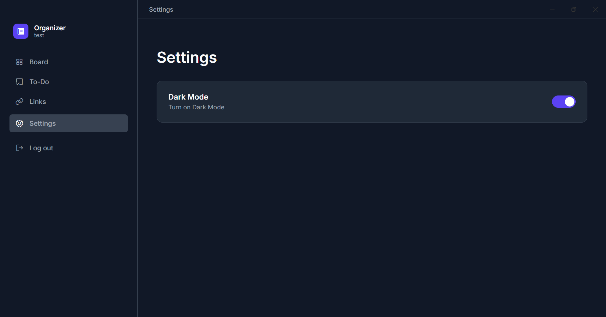

# Project Name: Organizer App (Group 02)

## Details
The passwords for the server and the database are the same which is the one attribute by the teacher for our group (group 02)

## 1. Project Description
This project is a Personal Organizer Application developed for the Web Development course. It allows users to manage a sticky notes board, tasks, save important links.

## 2. How to Run the Electron App

The Electron app is configured to automatically connect to our live university server.

### Prerequisites
* Node.js installed.
* **Important:** You must be connected to the **University VPN (EduVPN/Cisco)** or be on the internal network for the app to reach the server IP.

### Instructions
1.  Open a terminal in the project folder.
2.  Install dependencies (if first time): [npm install]
3.  Start the application: [npm start]

### Troubleshooting: Connection Issues

If the Electron App or Browser cannot connect to the server (Timeout or Connection Refused) or it works but the "testuser@gmail.com" (password: test) isnt found as a real user, you´re not connected yet to the server due to University Network restrictions, please use an **SSH Tunnel**.

1.  Open a second terminal and run this command: [ssh -L 8000:127.0.0.1:8000 admin@10.17.0.22].
2.  Keep that terminal open.
3.  The app will now be able to connect via the tunnel.
4.  Back in the first terminal, start the application again: [npm start].

## 3. How to run the server locally

### Prerequisites
* **MongoDB** installed and running locally
* **Node.js** installed.

### Start the server and database locally

The project includes data files on the folder `database_test`. To import this initial state to local MongoDB, run: [mongoimport --db project_dw --collection users --file database_test/users.json --jsonArray] (example for the users data)

### Start the Node Server
1.  Navigate to the project folder.
2.  Start the backend: [node src/backend/server.js]
3.  The server will run at `http://localhost:8000`.

## 4. Student Contributors

João Galvão - 2022214628:

 - Database Setup, Login/Register, CSS Implementation
 - Add Controller, endpoints, screen for Link saving section aswell as its integration and CSS
 - CSS updates for checkboxes
 - Deletion popups
 - Add Controller, endpoints, screen for Settings section aswell as its integration and CSS

Pedro Silva - 2022214963:

 - Add Controller, endpoints, screen for Board section and its Notes aswell as its integration and CSS
 - Fixed server connection retrys
 - Add Controller, endpoints, screen for To-Do section aswell as its integration and CSS
 - Implemented Multitab support aswell as pan and zoom in a Board